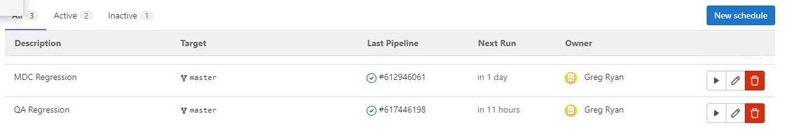
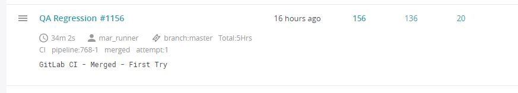
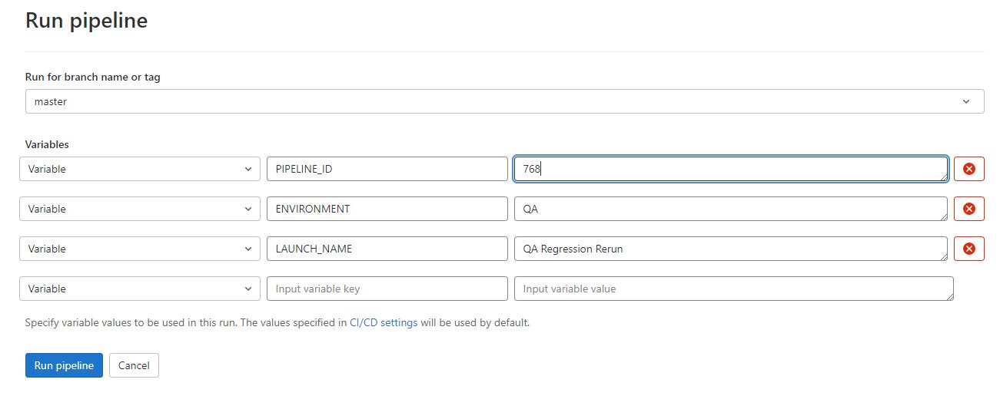
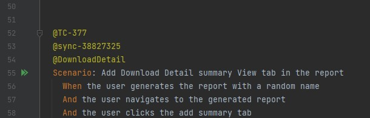
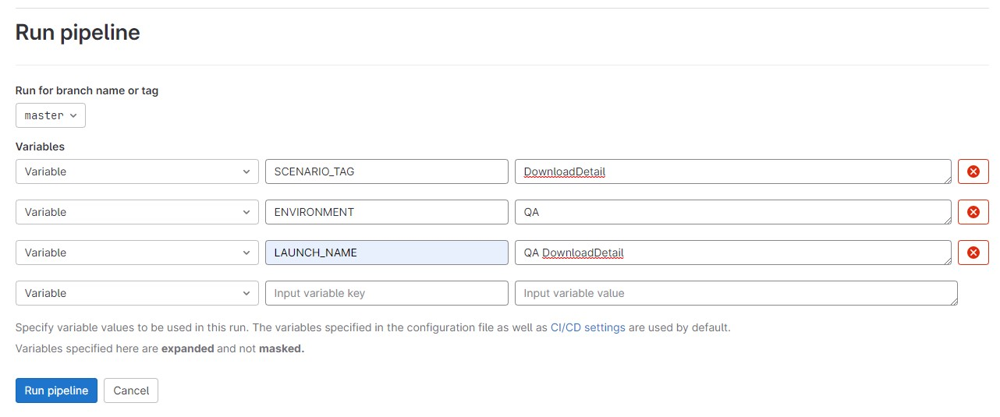
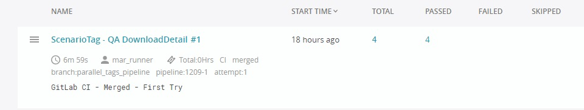

# NBA Automation

UI tests for NBA
<!-- TOC -->
- [Installation](#installation)
- [SerenityBDD](#serenitybdd-framework)
- [Run Serenity Project with Gradlew](#run-serenity-project-with-gradlew)
- [Regression CI Pipelines](#regression-ci-pipelines) 
- [Regression Rerun CI Pipelines](#regression-rerun-ci-pipelines)
- [Scenario Tag CI Pipelines](#scenario-tag-ci-pipelines)
- [Report Portal Integration](#report-portal-integration) 
- [MAR test case versioning](#mar-test-case-versioning) 
- [Spotless CI](#spotless-ci) 
- [AMS360 SDET Knowledge Base](#ams360-sdet-knowledge-base)
- [Recording Test Runs](#recording-test-runs)
<!-- /TOC -->

## Installation

This project requires Java Development Kit 11 for installation and execution. 
In Intellij, under Project Structure select a Java version 11 SDK 
 
## SerenityBDD Framework

From the SerenityBDD github page:

*Serenity BDD is an open source library that aims to make the idea of living documentation a reality. Serenity BDD 
helps you write cleaner and more maintainable automated acceptance and regression tests faster. Serenity also uses 
the test results to produce illustrated, narrative reports that document and describe what your application does and 
how it works. Serenity tells you not only what tests have been executed, but more importantly, what requirements have 
been tested.*

[SerenityBDD Github](https://github.com/serenity-bdd)

[Serenity Reference Manual](http://thucydides.info/docs/serenity-staging/)
 
## Run Serenity Project with Gradlew

Terminal command to run tests in the QA build - uses Midday agency
       
    ./gradlew clean test -Denvironment=QA

Terminal command to run tests in the mdc build  
  
    ./gradlew clean test -Denvironment=MDC

To run a single or subset of tests by tag, pass `-Dcucumber.filter.tags={{YOUR TAG}}"` as a system property.
   
    ./gradlew clean test --tests TestSupport -Dcucumber.filter.tags="@TC-300"
   

## Regression CI Pipelines

CI Pipelines are set up to run the Regression test suite on a scheduled basis.

Tests are run on multiple test runners in parallel.  Results are merged and the test report is Emailed.
All test cases are run against the QA environment.
In the MDC environment, test cases with Version tags greater than the version of MDC in the serenity.conf file will be skipped.

## Regression Rerun CI Pipelines

CI Pipelines can be set up to rerun failed tests from a previous Regression run using the `PIPELINE_ID` variable.

These CI Pipelines will only run the tests that failed on a previous test run.  
This can be useful if a Regression run partly failed due to environment issues, or changes to the environment (i.e. password fixes) were made.

First find the Pipeline ID on the Report Portal launches page with the tests you want rerun.
Remove the dash and number after it to get the value to use for `PIPELINE_ID` variable.

Create a Pipeline in Gitlab with the `PIPELINE_ID`, `ENVIRONMENT`, and `LAUNCH_NAME` variables.  
Use a `LAUNCH_NAME` that indicates this is a rerun of a previous Pipeline.

Rerun Pipelines are run with a reduced number of parallel test runners to allow running during work hours.

## Scenario Tag CI Pipelines

CI Pipelines can be set up to tests that have a particular Scenario Tag using the `SCENARIO_TAG` variable.

These CI Pipelines run all the tests with this Scenario Tag in 5 parallel jobs and sends the results to Report Portal.  
This can be useful for testing fixes to automation or a particular feature of MAR that is changing.  It acts as a filter
on the tests that are run.

First, find the Scenario Tag in the Feature files that you want to run.  The pipeline only works with a **single**
Scenario Tag. Remove the  `@` in front of the Tag to get the value to use for `SCENARIO_TAG` variable.

Run a Pipeline in Gitlab with the `SCENARIO_TAG`, `ENVIRONMENT`, and `LAUNCH_NAME` variables.  
Use a `LAUNCH_NAME` that indicates this is a related to a Scenario Tag.

Scenario Tag Pipelines are run with 5 parallel test runners to allow running during work hours.  
The Scenarios are run in a queue so all tests with the Tag are run even if the number exceeds the number of test runners.
If more parallel test runners are needed for even faster runs, you can make a branch and change the parallel number in the `.gitlab-ci.yml` file 
for that branch, and run the tests on that branch.

Scenario Tag Pipelines results are sent to Report Portal, but no Email report results are sent out.
The Launch Name will have `ScenarioTag - ` added to it to show that it is not a full regression run.

## Report Portal Integration

Results from CI Pipelines for Regression and Rerun are recorded in Report Portal 
[Link to Report Portal](http://172.17.113.196:8080/ui/#mar/launches/latest)

Email test reports from Report Portal are sent to SDETs after each regression run. SDETs need to analyze and fix failures for test cases.
    

## NBA Test Case versioning

All new MAR tests that contain features that aren't currently deployed to all environments need to have @Version tags 
added so the tests won't run in the MDC environment before those changes are available in MDC.

A tag of `@version-22R2` will only be run in MDC when the version of `22R2` is in the serenity.conf file for the **MDC** environment.

Versions are based on the tree structure for MAR test cases in qTest.

## Spotless CI

This plugin enforces project adherence to [google java format - 1.11](https://google.github.io/styleguide/javaguide.html).
There is a stage in the Continuous integration of Merge Requests where it checks if spotlessJava has been applied.
To ensure the spotless stage passes (which is required for Merge Requests), please manually run
    
    ./gradlew spotlessJavaApply
    
or run the Gradle spotlessJavaApply task that's under the `other` folder in Gradle Task in IntelliJ.

